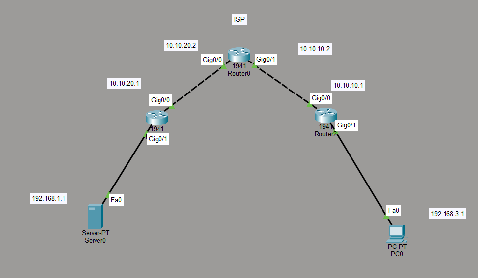
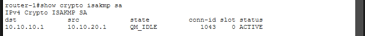
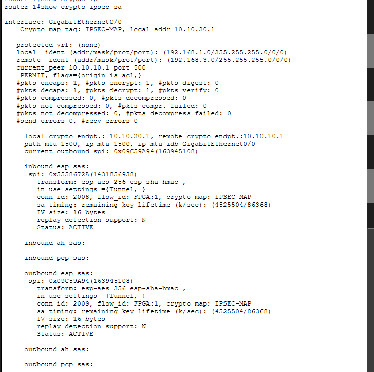
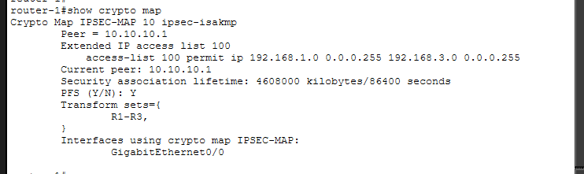
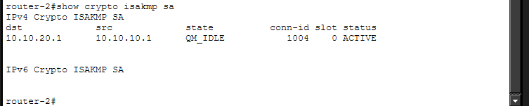
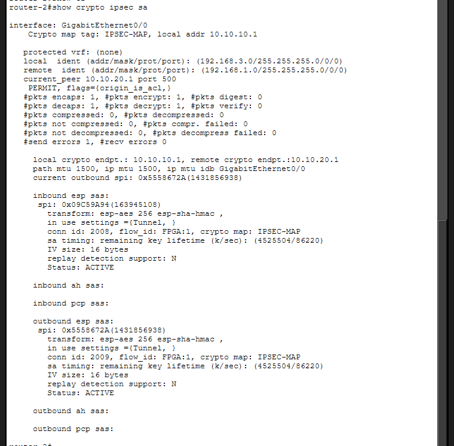
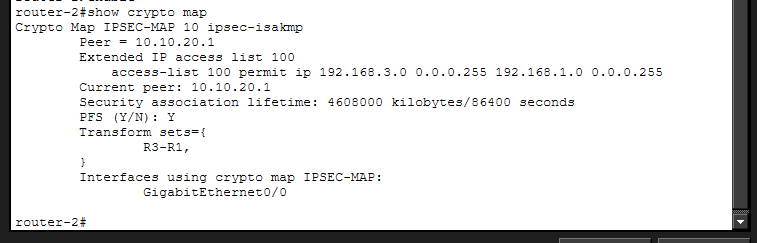
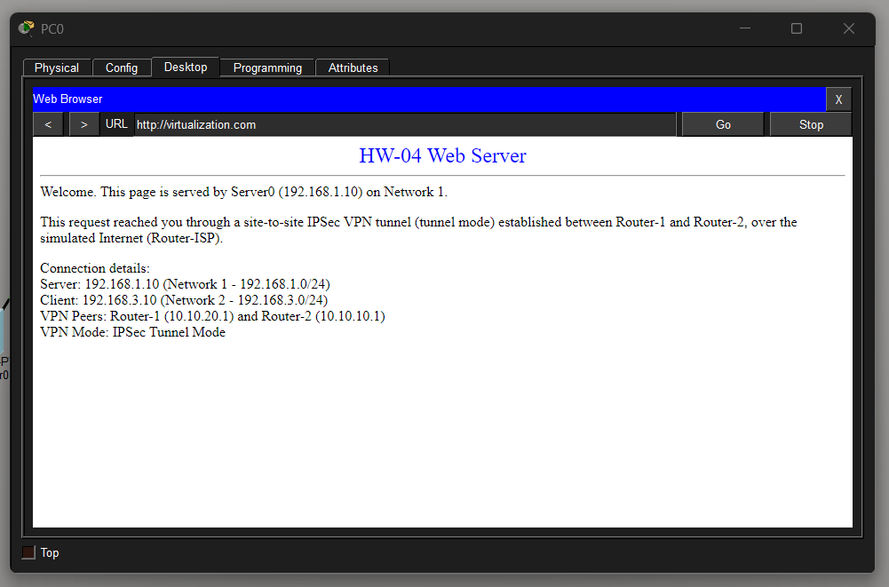

# HW-04 — Site-to-Site IPSec VPN (Tunnel Mode) over a Simulated Internet

This branch documents the configuration of a site-to-site IPSec VPN between two networks, connected through a router that simulates the Internet (ISP), as required by the assignment. A web server on Network 1 is reachable, over the VPN, from a host on Network 2 using HTTPS.

## Topology

- **Router-ISP** acts only as the simulated Internet / transit ISP. It is **not** an IPSec peer; it simply routes between the two `/30` transit networks.
- **Router-1** and **Router-2** are the two IPSec peers (the actual VPN gateways).
- **Server0** (`Network 1`) hosts the web service.
- **PC0** (`Network 2`) is the client that reaches the web server through the tunnel.

## IP Addressing Table

| Device  | Interface | IP Address     | Subnet Mask       | Connects to |
|---------|-----------|----------------|--------------------|-------------|
| Router-ISP | Gig0/0 | 10.10.20.2 | 255.255.255.252 | Router-1 Gig0/0 |
| Router-ISP | Gig0/1 | 10.10.10.2 | 255.255.255.252 | Router-2 Gig0/0 |
| Router-1 | Gig0/0 | 10.10.20.1 | 255.255.255.252 | Router-ISP Gig0/0 |
| Router-1 | Gig0/1 | 192.168.1.1 | 255.255.255.0 | Server0 Fa0 |
| Router-2 | Gig0/0 | 10.10.10.1 | 255.255.255.252 | Router-ISP Gig0/1 |
| Router-2 | Gig0/1 | 192.168.3.1 | 255.255.255.0 | PC0 Fa0 |
| Server0 | Fa0 | 192.168.1.10 | 255.255.255.0 | Router-1 Gig0/1 |
| PC0 | Fa0 | 192.168.3.10 | 255.255.255.0 | Router-2 Gig0/1 |

**Networks encrypted by the VPN:** `192.168.1.0/24` (Router-1 LAN) ↔ `192.168.3.0/24` (Router-2 LAN)
**IPSec peers (public/transit addresses):** `10.10.20.1` (Router-1) ↔ `10.10.10.1` (Router-2)

## Device Configurations

### Router-ISP (simulated ISP — no IPSec, transit only)

- Hostname: `Router-ISP`
- Gig0/0: `10.10.20.2 / 255.255.255.0`
- Gig0/1: `10.10.10.2 / 255.255.255.0`
- No static routes needed — both transit networks (`10.10.20.0/30` and `10.10.10.0/30`) are directly connected, so Router-ISP can already forward traffic between them.

### Router-1 (VPN Gateway — Network 1 / 192.168.1.0/24)

- Hostname: `Router-1`
- Gig0/0: `10.10.20.1 / 255.255.255.0` (public/transit side)
- Gig0/1: `192.168.1.1 / 255.255.255.0` (LAN side)
- Default route: `0.0.0.0/0` via `10.10.20.2` (Router-ISP)

### Router-2 (VPN Gateway — Network 2 / 192.168.3.0/24)

- Hostname: `Router-2`
- Gig0/0: `10.10.10.1 / 255.255.255.0` (public/transit side)
- Gig0/1: `192.168.3.1 / 255.255.255.0` (LAN side)
- Default route: `0.0.0.0/0` via `10.10.10.2` (Router-ISP)

### Server0 (Server-PT) — Web Server

| Setting | Value |
|---|---|
| IP Address | 192.168.1.10 |
| Subnet Mask | 255.255.255.0 |
| Default Gateway | 192.168.1.1 |
| HTTP service | ON |

### PC0 (PC-PT) — Client

| Setting | Value |
|---|---|
| IP Address | 192.168.3.10 |
| Subnet Mask | 255.255.255.0 |
| Default Gateway | 192.168.3.1 |

## Verification

The following commands confirm the VPN is up and correctly applied. Run each one on both **Router-1** and **Router-2**.

- `show crypto isakmp sa`: checks IKE Phase 1 (ISAKMP). It should show a `QM_IDLE` or `ACTIVE` state, indicating the initial secure channel is ready.
- `show crypto ipsec sa`: checks IPsec Phase 2. It shows the encrypted, decrypted, encapsulated, and decapsulated packet counters.
- `show crypto map`: verifies that the crypto map is correctly applied to the right router interface.

### Router-1

### Router-2

## HTTPS Test

From **PC0** (`192.168.3.10`), open the **Web Browser** app on the Desktop and browse to `https://192.168.1.10`.

Note: To access the web service, browse to `virtualization.com` (instead of the raw IP).

### Screenshot — Request and Response

## Packet Tracer File

[hw-04.pkt](./hw-04.pkt)

## Repository
- **GitHub Repository:** *https://github.com/alejandrocald13/virtualizacion-26*
- **Branch:** `hw-04`