# Assessment 02 — MetalLB + Traefik: Multiple Services Behind a Single IP

## 1. Overview

This assessment exposes four web applications running in a local Minikube cluster through a **single IP address**. MetalLB assigns that IP to the `LoadBalancer` Service of Traefik, and Traefik routes each request to the right application based on its domain name.

- **Student:** Roberto Calderón
- **Applications namespace:** `parcial-racm`
- **Load balancer IP:** `192.168.49.200`
- **Base domain:** `racm.assessment2`

## 2. Environment

| Component | Value |
|---|---|
| Host OS | Windows + WSL2 (NAT networking) |
| Kubernetes | Minikube v1.39.0 (driver `docker`, runtime `containerd`) |
| kubectl | v1.37.1 |
| Docker | Docker Engine 29.8.2 (native in Ubuntu 24.04 on WSL2) |
| Minikube node IP | `192.168.49.2` (Docker network `minikube`, `192.168.49.0/24`) |
| MetalLB | v0.16.1 (namespace `metallb-system`) |
| Traefik | v3.7.13 (namespace `traefik`) |

## 3. Architecture

```
Windows browser
  nginx | httpd | whoami | podinfo  .racm.assessment2
        |
        v
hosts file: 192.168.49.200
        |
        v
MetalLB (speaker, L2)  ->  Service traefik (LoadBalancer)   [namespace traefik]
        |
        v
Traefik Pod  ->  Ingress rules by Host                      [namespace parcial-racm]
        |
        +--> Service nginx   ->  nginx Pods
        +--> Service httpd   ->  httpd Pods
        +--> Service whoami  ->  whoami Pods
        +--> Service podinfo ->  podinfo Pods (9898)
```

## 4. Repository Structure

```
.
├── README.md
├── metallb/
│   ├── metallb-native.yaml
│   ├── ipaddresspool.yaml
│   └── l2advertisement.yaml
├── traefik/
│   ├── 00-namespace.yaml
│   ├── 01-rbac.yaml
│   ├── 02-ingressclass.yaml
│   ├── 03-deployment.yaml
│   └── 04-service.yaml
├── apps/
│   ├── 00-namespace.yaml
│   ├── nginx.yaml
│   ├── httpd.yaml
│   ├── whoami.yaml
│   └── podinfo.yaml
└── docs/
```

## 5. MetalLB Installation and Configuration

### 5.1 Installation

```bash
minikube start
mkdir metallb
curl -fL -o metallb/metallb-native.yaml https://raw.githubusercontent.com/metallb/metallb/v0.16.1/config/manifests/metallb-native.yaml
kubectl apply -f metallb/metallb-native.yaml
kubectl wait -n metallb-system --for=condition=Ready pod --all --timeout=120s
```

File: [metallb/metallb-native.yaml](./metallb/metallb-native.yaml)

### 5.2 IP Address Pool

```yaml
apiVersion: metallb.io/v1beta1
kind: IPAddressPool
metadata:
  name: assessment-2-pool
  namespace: metallb-system
spec:
  addresses:
  - 192.168.49.200/32
  autoAssign: false
```

```bash
kubectl apply --dry-run=server -f metallb/ipaddresspool.yaml
kubectl apply -f metallb/ipaddresspool.yaml
```

File: [metallb/ipaddresspool.yaml](./metallb/ipaddresspool.yaml)

### 5.3 L2 Advertisement

```yaml
apiVersion: metallb.io/v1beta1
kind: L2Advertisement
metadata:
  name: assessment-2-l2
  namespace: metallb-system
spec:
  ipAddressPools:
  - assessment-2-pool
```

```bash
kubectl apply -f metallb/l2advertisement.yaml
```

File: [metallb/l2advertisement.yaml](./metallb/l2advertisement.yaml)

### 5.4 Verification

```bash
kubectl get pods -n metallb-system
kubectl get ipaddresspools,l2advertisements -n metallb-system
```

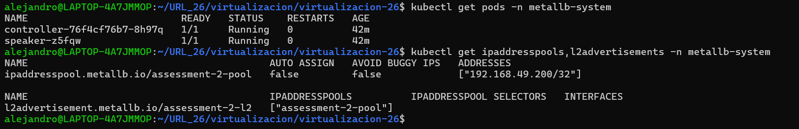

### 5.5 Allow the Node to Announce the IP

```bash
kubectl label node minikube node.kubernetes.io/exclude-from-external-load-balancers-
kubectl get servicel2statuses -n metallb-system
```

## 6. Traefik Installation and Configuration

### 6.1 Namespace

```yaml
apiVersion: v1
kind: Namespace
metadata:
  name: traefik
```

File: [traefik/00-namespace.yaml](./traefik/00-namespace.yaml)

### 6.2 RBAC

```yaml
apiVersion: v1
kind: ServiceAccount
metadata:
  name: traefik
  namespace: traefik

---
apiVersion: rbac.authorization.k8s.io/v1
kind: ClusterRole
metadata:
  name: traefik
rules:
  - apiGroups:
      - ""
    resources:
      - services
      - secrets
      - nodes
    verbs:
      - get
      - list
      - watch
  - apiGroups:
      - discovery.k8s.io
    resources:
      - endpointslices
    verbs:
      - list
      - watch
  - apiGroups:
      - networking.k8s.io
    resources:
      - ingresses
      - ingressclasses
    verbs:
      - get
      - list
      - watch
  - apiGroups:
      - networking.k8s.io
    resources:
      - ingresses/status
    verbs:
      - update

---

apiVersion: rbac.authorization.k8s.io/v1
kind: ClusterRoleBinding
metadata:
  name: traefik
roleRef:
  apiGroup: rbac.authorization.k8s.io
  kind: ClusterRole
  name: traefik
subjects:
  - kind: ServiceAccount
    name: traefik
    namespace: traefik
```

File: [traefik/01-rbac.yaml](./traefik/01-rbac.yaml)

### 6.3 IngressClass

```yaml
apiVersion: networking.k8s.io/v1
kind: IngressClass
metadata:
  name: traefik
spec:
  controller: traefik.io/ingress-controller
```

File: [traefik/02-ingressclass.yaml](./traefik/02-ingressclass.yaml)

### 6.4 Deployment

```yaml
apiVersion: apps/v1
kind: Deployment
metadata:
  name: traefik
  namespace: traefik
  labels:
    app: traefik
spec:
  replicas: 1
  selector:
    matchLabels:
      app: traefik
  template:
    metadata:
      labels:
        app: traefik
    spec:
      serviceAccountName: traefik
      containers:
        - name: traefik
          image: traefik:v3.7.13
          args:
            - --entrypoints.web.address=:80
            - --providers.kubernetesingress=true
            - --providers.kubernetesingress.ingressclass=traefik
            - --providers.kubernetesingress.ingressendpoint.publishedservice=traefik/traefik
            - --log.level=INFO
          ports:
            - name: web
              containerPort: 80
          resources:
            requests:
              cpu: 50m
              memory: 64Mi
```

File: [traefik/03-deployment.yaml](./traefik/03-deployment.yaml)

### 6.5 LoadBalancer Service

```yaml
apiVersion: v1
kind: Service
metadata:
  name: traefik
  namespace: traefik
  annotations:
    metallb.io/loadBalancerIPs: 192.168.49.200
spec:
  type: LoadBalancer
  selector:
    app: traefik
  ports:
    - name: web
      port: 80
      targetPort: web
```

File: [traefik/04-service.yaml](./traefik/04-service.yaml)

### 6.6 Verification

```bash
kubectl apply -f traefik/
kubectl get pods,svc -n traefik
kubectl describe svc traefik -n traefik
curl -i http://192.168.49.200
ip neigh show 192.168.49.200
```

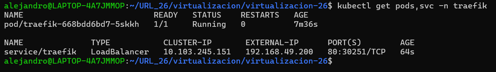

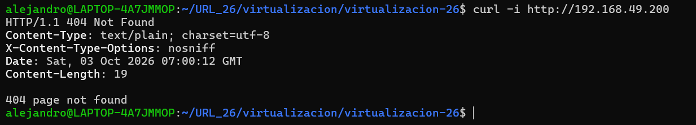

## 7. Applications (namespace `parcial-racm`)

| App | Image | Container port | Service port | Host |
|---|---|---|---|---|
| nginx | `nginx:1.27` | 80 | 80 | `nginx.racm.assessment2` |
| httpd | `httpd:2.4` | 80 | 80 | `httpd.racm.assessment2` |
| whoami | `traefik/whoami:v1.12.0` | 80 | 80 | `whoami.racm.assessment2` |
| podinfo | `stefanprodan/podinfo:6.15.0` | 9898 | 80 | `podinfo.racm.assessment2` |

### 7.1 Namespace

```yaml
apiVersion: v1
kind: Namespace
metadata:
  name: parcial-racm
```

File: [apps/00-namespace.yaml](./apps/00-namespace.yaml)

### 7.2 Manifests

```yaml
apiVersion: apps/v1
kind: Deployment
metadata:
  name: nginx
  namespace: parcial-racm
  labels:
    app: nginx
spec:
  replicas: 3
  selector:
    matchLabels:
      app: nginx
  template:
    metadata:
      labels:
        app: nginx
    spec:
      containers:
        - name: nginx
          image: nginx:1.27
          ports:
            - name: http
              containerPort: 80
---
apiVersion: v1
kind: Service
metadata:
  name: nginx
  namespace: parcial-racm
spec:
  type: ClusterIP
  selector:
    app: nginx
  ports:
    - name: http
      port: 80
      targetPort: http
---
apiVersion: networking.k8s.io/v1
kind: Ingress
metadata:
  name: nginx
  namespace: parcial-racm
spec:
  ingressClassName: traefik
  rules:
    - host: nginx.racm.assessment2
      http:
        paths:
          - path: /
            pathType: Prefix
            backend:
              service:
                name: nginx
                port:
                  number: 80
```

- [apps/nginx.yaml](./apps/nginx.yaml)
- [apps/httpd.yaml](./apps/httpd.yaml)
- [apps/whoami.yaml](./apps/whoami.yaml)
- [apps/podinfo.yaml](./apps/podinfo.yaml)

### 7.3 Verification

```bash
kubectl apply -f apps/
kubectl get all,ingress -n parcial-racm
kubectl get endpointslices -n parcial-racm
for h in nginx httpd whoami podinfo; do echo "--- $h.racm.assessment2"; curl -s -H "Host: $h.racm.assessment2" http://192.168.49.200 | head -n 4; done
```

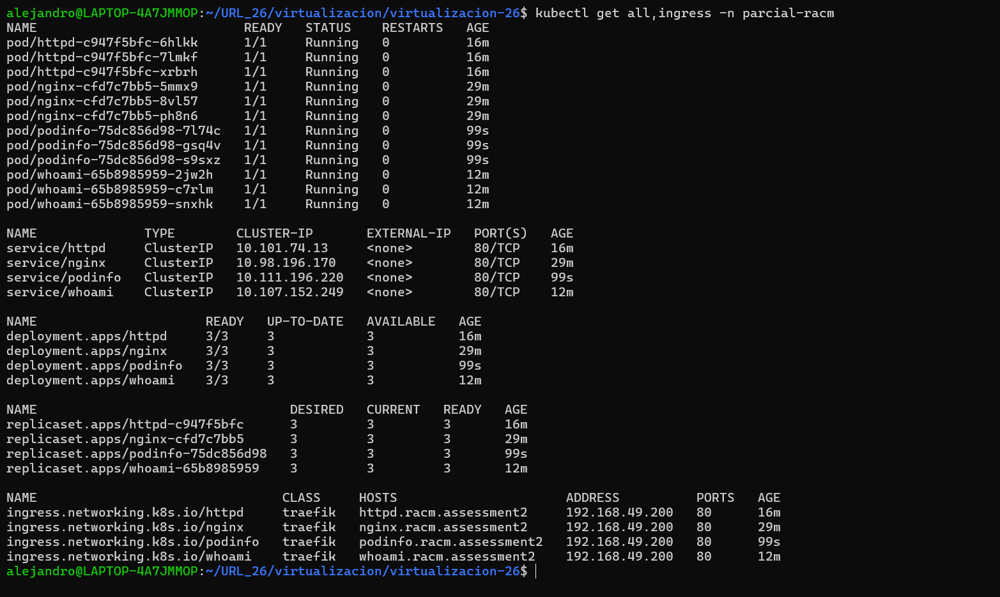

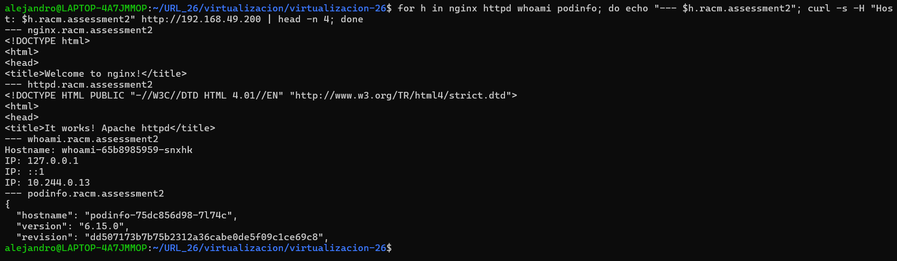

## 8. Local DNS Configuration

### 8.1 WSL (`/etc/hosts`)

```bash
printf '\n[network]\ngenerateHosts = false\n' | sudo tee -a /etc/wsl.conf
sudo cp /etc/hosts /etc/hosts.bak
echo "192.168.49.200 nginx.racm.assessment2 httpd.racm.assessment2 whoami.racm.assessment2 podinfo.racm.assessment2" | sudo tee -a /etc/hosts
getent hosts nginx.racm.assessment2 httpd.racm.assessment2 whoami.racm.assessment2 podinfo.racm.assessment2
```

```ini
[network]
generateHosts = false
```

```
192.168.49.200 nginx.racm.assessment2 httpd.racm.assessment2 whoami.racm.assessment2 podinfo.racm.assessment2
```

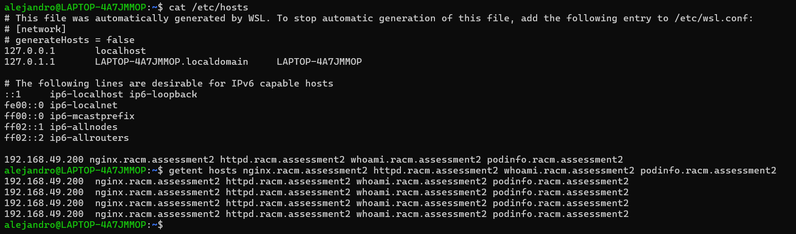

### 8.2 Windows (`C:\Windows\System32\drivers\etc\hosts`)

```powershell
Copy-Item C:\Windows\System32\drivers\etc\hosts C:\Windows\System32\drivers\etc\hosts.bak
notepad C:\Windows\System32\drivers\etc\hosts
ipconfig /flushdns
curl.exe -i http://nginx.racm.assessment2
```

```
192.168.49.200 nginx.racm.assessment2 httpd.racm.assessment2 whoami.racm.assessment2 podinfo.racm.assessment2
```

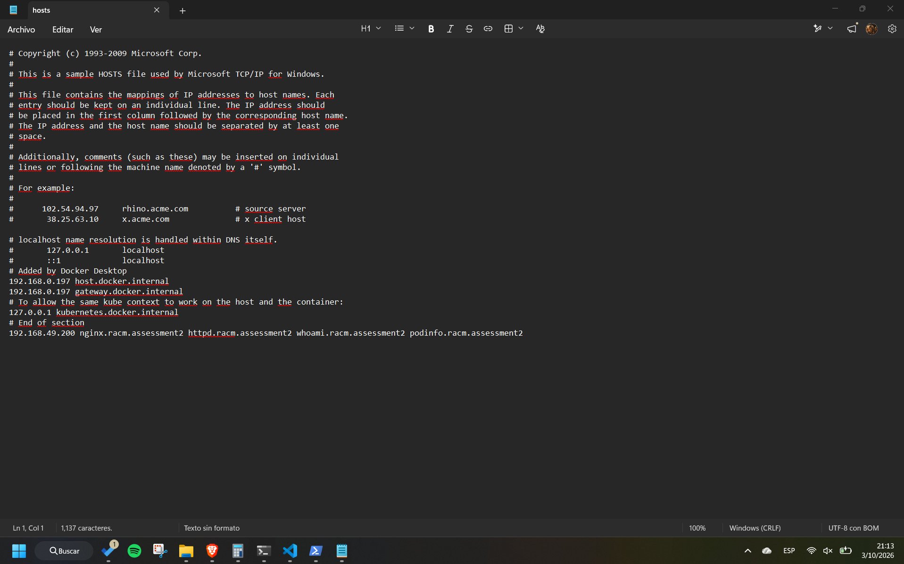

## 9. Access from the Windows Browser

### 9.1 WSL: Allow Forwarding to the Docker Bridge

```bash
cat /proc/sys/net/ipv4/ip_forward
ip -br link | grep br-
ip -4 addr show eth0 | grep inet
sudo iptables -I DOCKER-USER -i eth0 -o br-a6ebb5719eea -j ACCEPT
sudo iptables -L DOCKER-USER -v -n --line-numbers
```

### 9.2 Windows: Route to the Minikube Network

```powershell
route add 192.168.49.0 mask 255.255.255.0 172.24.205.85
route print 192.168.49.*
Test-NetConnection 192.168.49.200 -Port 80
curl.exe -i http://192.168.49.200
```

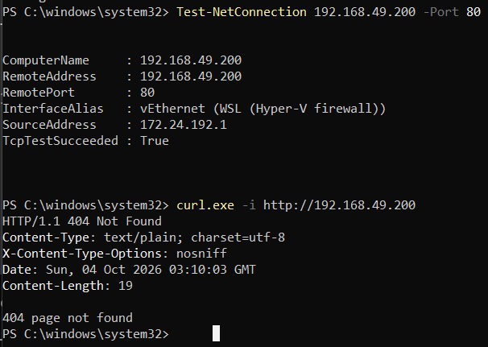

### 9.3 Persistence After Restart

WSL:

```bash
sudo systemctl start docker
minikube start
kubectl label node minikube node.kubernetes.io/exclude-from-external-load-balancers-
ip -br link | grep br-
ip -4 addr show eth0 | grep inet
sudo iptables -I DOCKER-USER -i eth0 -o br-a6ebb5719eea -j ACCEPT
```

Windows (PowerShell as administrator), using the new WSL IP:

```powershell
route delete 192.168.49.0
route add 192.168.49.0 mask 255.255.255.0 <WSL_IP>
```

## 10. Browser Tests

### nginx — `http://nginx.racm.assessment2/`

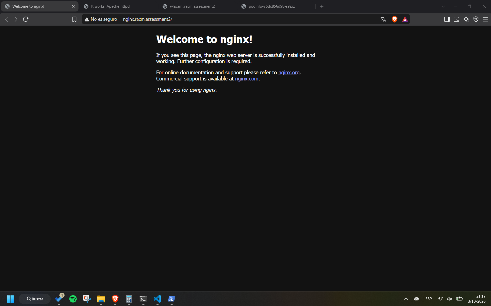

### httpd — `http://httpd.racm.assessment2/`

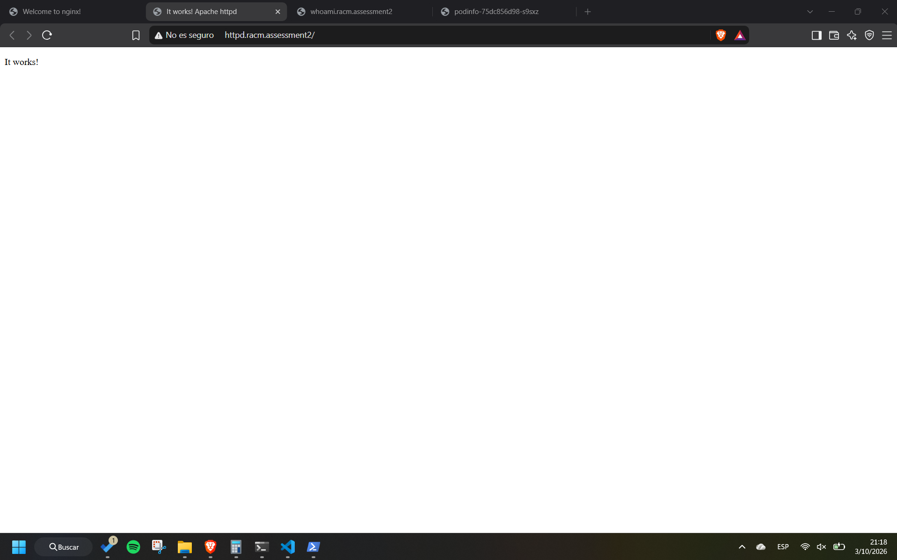

### whoami — `http://whoami.racm.assessment2/`

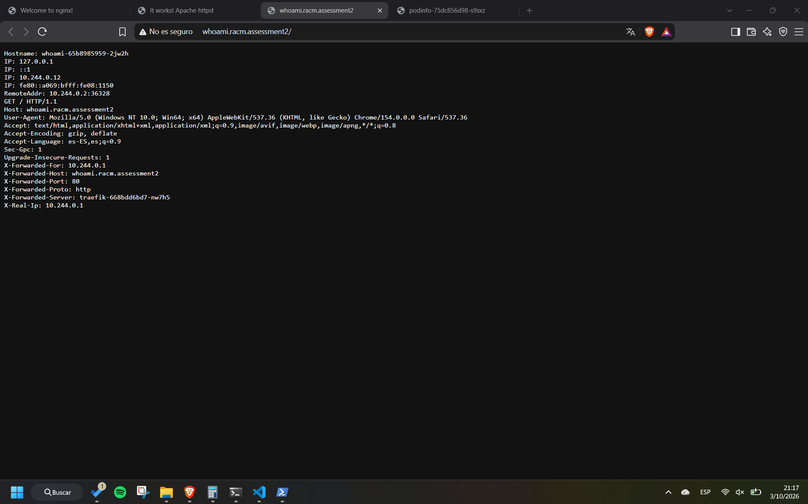

### podinfo — `http://podinfo.racm.assessment2/`

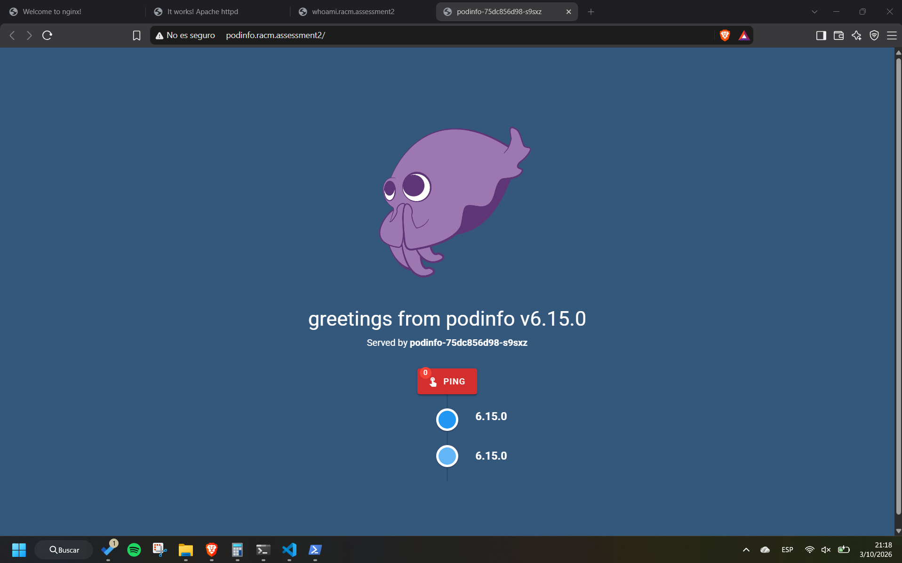

## 11. Repository

- **GitHub Repository:** *https://github.com/alejandrocald13/virtualizacion-26*
- **Branch:** `assessment-02`
