# ZeroTier Virtual SDN — Assessment 01

## 1. Overview

Brief description of the activity: creation of a private virtual network (SDN) using ZeroTier to interconnect four virtual machines, with one of them acting as a router.

- **Team members:** Juan Luarca, Carlos Vela, Roberto Calderón, Francisco Quemé
- **Router VM:** Juan Luarca

## 2. ZeroTier Network Creation

- **Network ID:** `60ee7c034a4afe09`
- **Network name:** virtualization-network
- **IP range / CIDR assigned:** e.g. `10.59.1.0/24`
- Steps taken in ZeroTier Central to create the network.

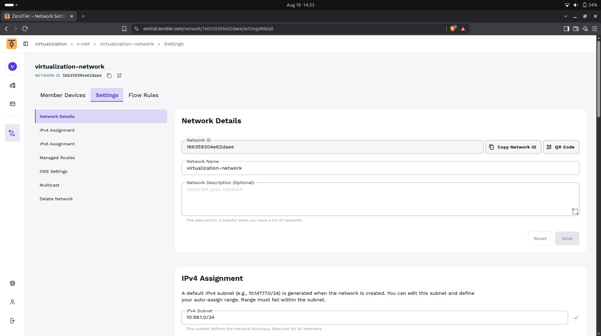

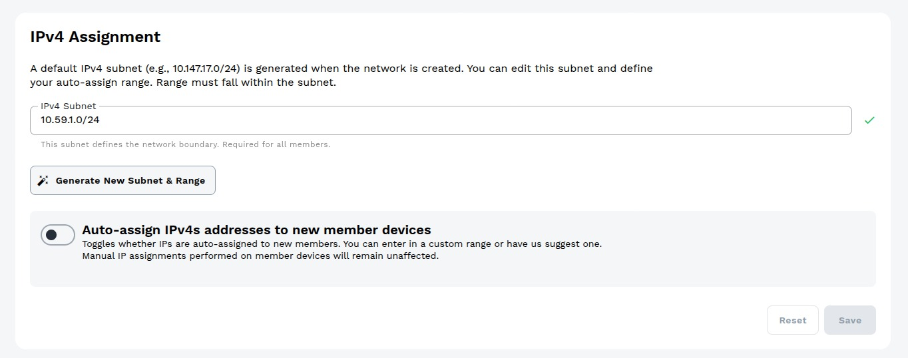

## 3. Joining the Virtual Machines to the Network

For each of the 4 VMs:

- Command used to install/join ZeroTier (e.g. `curl -s https://install.zerotier.com | sudo bash`, `zerotier-cli join 60ee7c034a4afe09`)
- Confirmation that the VM appears as authorized in ZeroTier Central

**VM Juan Luarca (Router)**

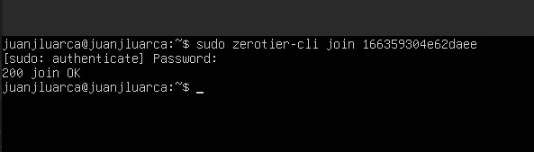

**VM Carlos Vela**

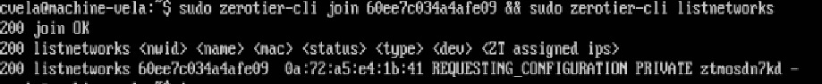

**VM Roberto Calderón**

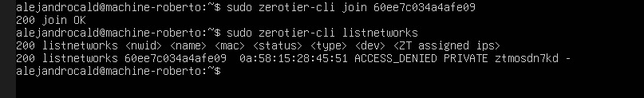

**VM Francisco Quemé**

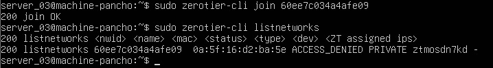

### 3.1 List of Unauthorized Devices

### 3.2 List of Authorized Devices

## 4. Static IP Assignment

| VM | Hostname | Assigned ZeroTier IP | Role |
|----|----------|----------------------|------|
| VM1 | [router-juan] | 10.59.1.1 | Router |
| VM2 | [machine-vela] | 10.59.1.2 | Client |
| VM3 | [machine-roberto] | 10.59.1.4 | Client |
| VM4 | [machine-pancho] | 10.59.1.3 | Client |

- Method used to assign static IPs (via ZeroTier Central "Managed IPs" and/or OS-level static config).

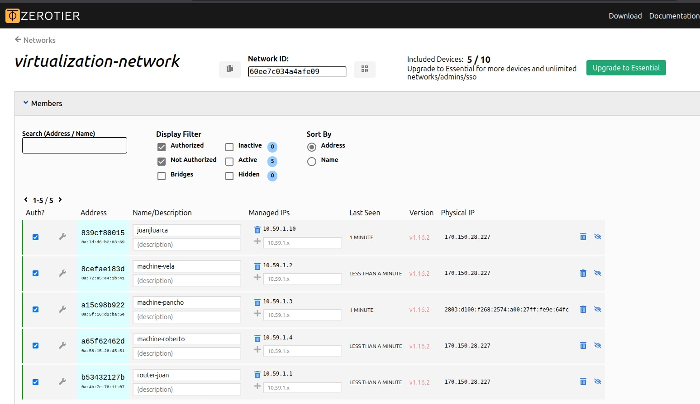

## 5. Hostname Configuration

- Command(s) used on each VM to set the hostname (e.g. `hostnamectl set-hostname <name>`)
- Confirmation output (`hostname` command) for each machine.

**VM Juan Luarca (Router)**

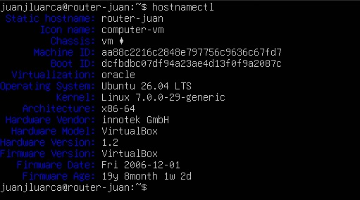

**VM Carlos Vela**

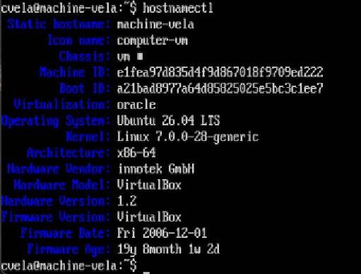

**VM Roberto Calderón**

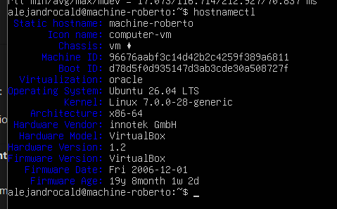

**VM Francisco Quemé**

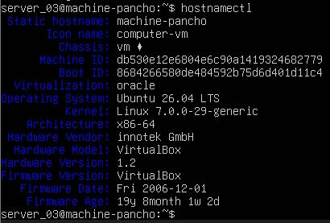

## 6. Router Configuration

- **IP forwarding:**
  - Command(s) used to enable IP forwarding (e.g. `sysctl -w net.ipv4.ip_forward=1`, persisted in `/etc/sysctl.conf`)
  - Verification output

  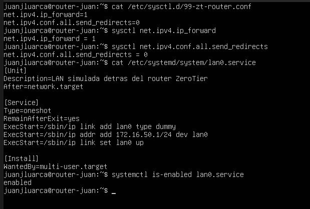

- **Managed Routes (ZeroTier Central):**
  - Route(s) configured (destination subnet, via which ZeroTier address)

  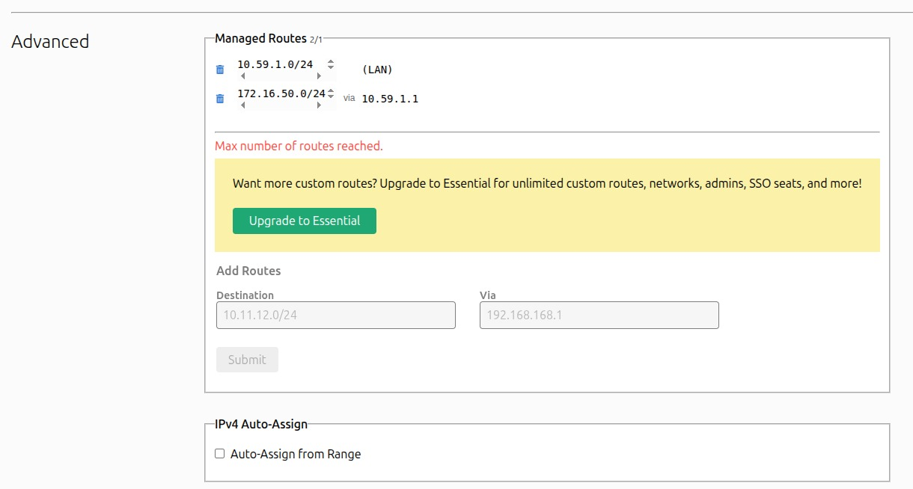

## 7. Connectivity Testing

- Ping results between all 4 machines (pairwise), including traffic that must pass through the router
- Table or list summarizing which pings were successful

| From | To | Result |
|------|----|--------|
| VM1 | VM2 | ✅ |
| VM1 | VM3 | ✅ |
| VM1 | VM4 | ✅ |
| VM2 | VM3 | ✅ |
| VM2 | VM4 | ✅ |
| VM3 | VM4 | ✅ |

**VM Juan Luarca (Router)**

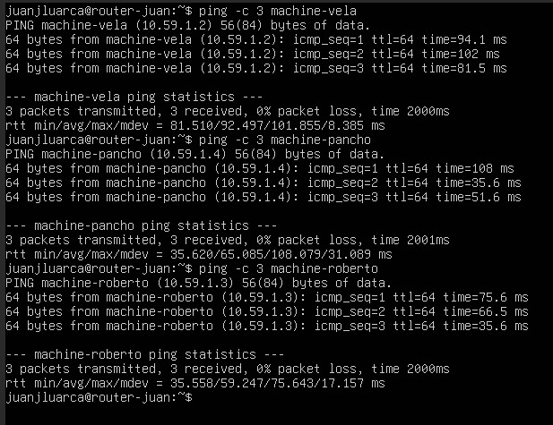

**VM Carlos Vela**

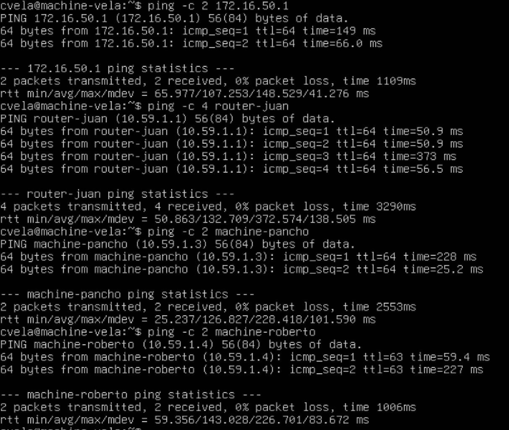

**VM Roberto Calderón**

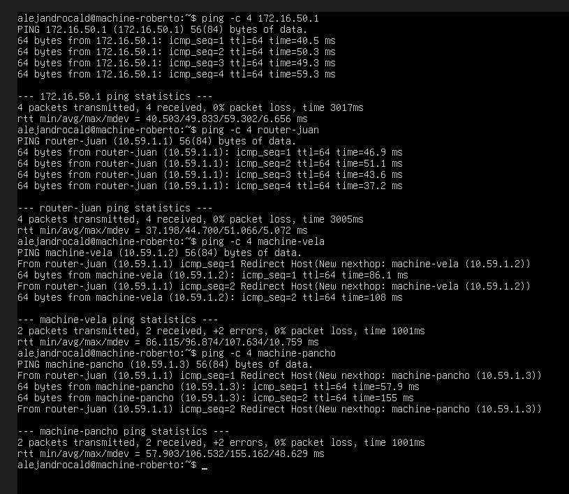

**VM Francisco Quemé**

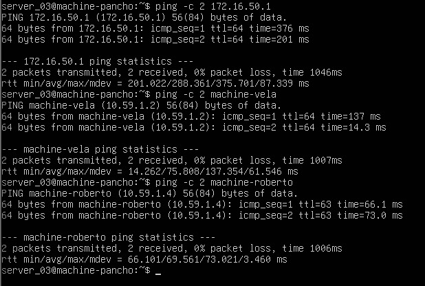

## 8. Demonstration Video

- **Video link:** [URL](https://drive.google.com/file/d/1z8SXQtDoTRwNAELLz6uOeCfMMYI-iIOP/view)
- Brief description of what the video shows (pings between all machines, traffic routed through the router VM).

## 9. Repository Structure

- Branch: `assessment-01` (created from `main`)
- Notes on any scripts, configs, or additional files included in this branch.