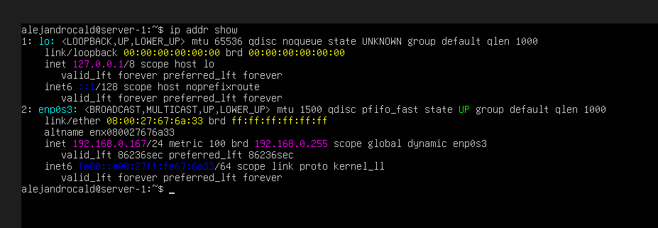
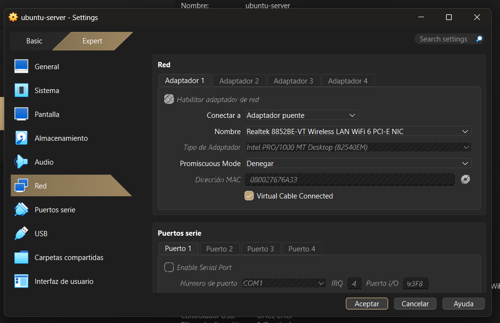
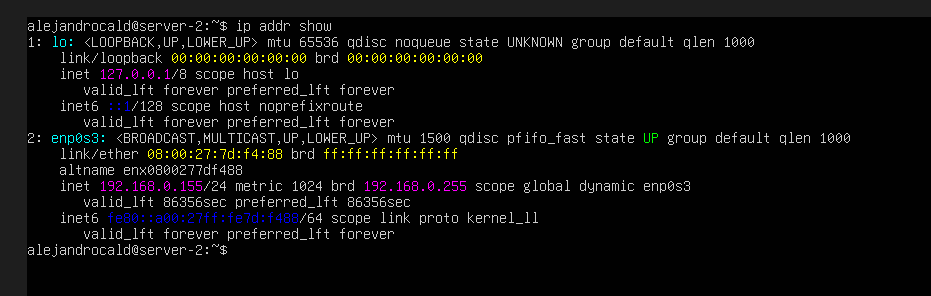
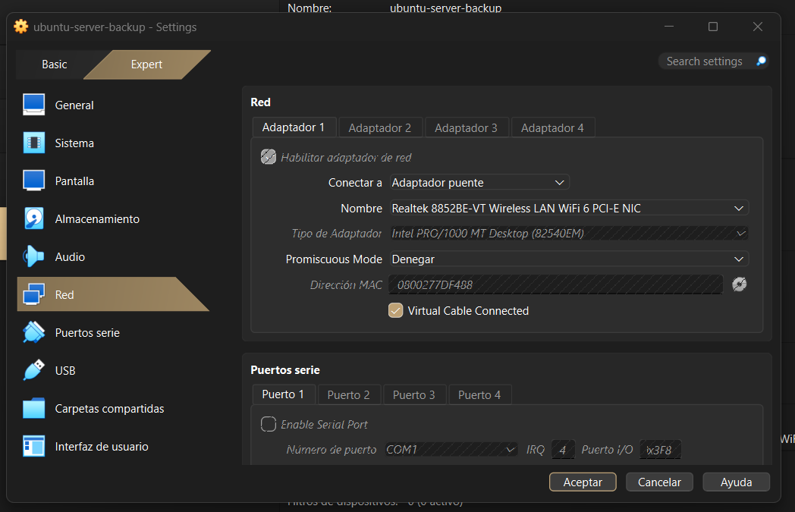
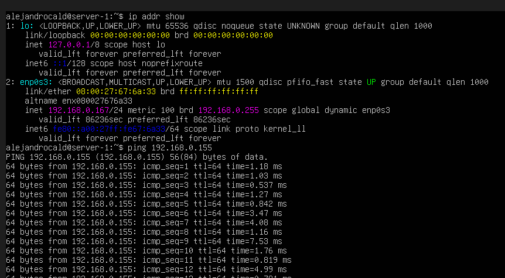
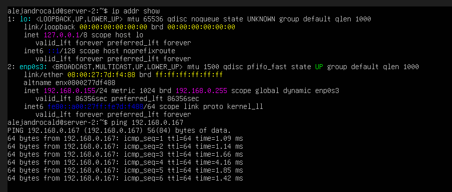

# Homework 02 - VirtualBox Network Communication Between Two Servers

## Objective
Configure two virtual servers in VirtualBox, assign each an IP address within the home subnet, set a hostname for each, and verify communication between them using `ping`.

## Environment
- **Virtualization Software:** VirtualBox
- **Operating System (VMs):** Ubuntu Server
- **Network Mode:** Bridged Adapter
- **Home Subnet:** 192.168.0.1/24

## Server 1

### Hostname Configuration

### Network Configuration

- **Hostname:** `server-1`
- **IP Address:** `192.168.0.167`

## Server 2

### Hostname Configuration

### Network Configuration

- **Hostname:** `server-2`
- **IP Address:** `192.168.0.155`

## Connectivity Test (Ping)

### Ping from Server 1 to Server 2

### Ping from Server 2 to Server 1 (optional, for extra verification)

## Repository
- **GitHub Repository:** *https://github.com/alejandrocald13/virtualizacion-26*
- **Branch:** `hw-02`