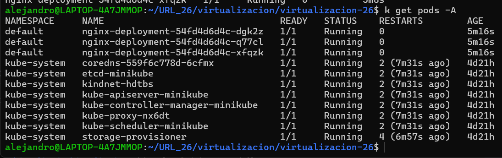
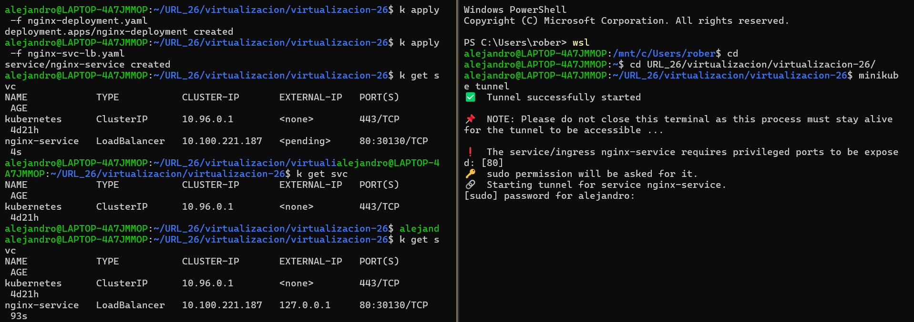
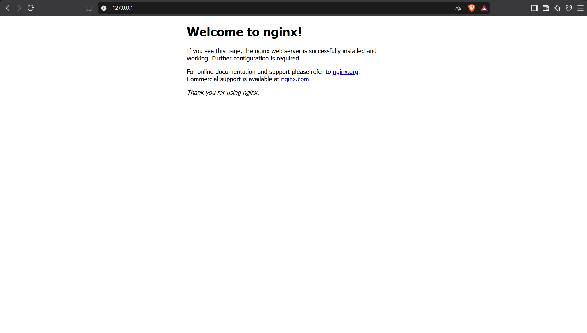

# HW-05 — Kubernetes Service for Nginx

This assignment deploys Nginx with a Kubernetes Deployment and exposes it through a `LoadBalancer` Service, so the Nginx port can be reached from the local browser.

## Environment

- Local Kubernetes cluster: Minikube (running on WSL2)
- Namespace: `default`
- Image: `nginx:1.14.2`

## Manifests

### Deployment — nginx-deployment.yaml

```yaml
apiVersion: apps/v1
kind: Deployment
metadata:
  name: nginx-deployment
  labels:
    app: nginx
spec:
  replicas: 3
  selector:
    matchLabels:
      app: nginx
  template: 
    metadata:
      labels:
        app: nginx
    spec:
      containers:
      - name: nginx
        image: nginx:1.14.2
        ports:
        - containerPort: 80
```

- `replicas: 3` runs three Nginx pods.
- The label `app: nginx` is what the Service uses to select the pods.
- `containerPort: 80` is the port Nginx listens on inside the container.

File: [nginx-deployment.yaml](./nginx-deployment.yaml)

### Service — nginx-svc-lb.yaml

```yaml
apiVersion: v1
kind: Service
metadata:
  name: nginx-service
spec:
  type: LoadBalancer
  selector:
    app: nginx
  ports:
    - protocol: TCP
      port: 80
      targetPort: 80
```

- `type: LoadBalancer` exposes the Service outside the cluster.
- `selector: app: nginx` links the Service to the pods created by the Deployment.
- `port: 80` is the port exposed by the Service; `targetPort: 80` is the Nginx container port.

File: [nginx-svc-lb.yaml](./nginx-svc-lb.yaml)

## Deployment Steps

```bash
minikube start
kubectl apply -f nginx-deployment.yaml
kubectl apply -f nginx-svc-lb.yaml
kubectl get pods -l app=nginx
```

In Minikube, the `LoadBalancer` Service keeps `EXTERNAL-IP` as `<pending>` until a tunnel is opened. Run this in a separate terminal and keep it open (it asks for the `sudo` password because the Service uses the privileged port 80):

```bash
minikube tunnel
```

## Namespace Verification

Both resources were created in the `default` namespace. The following command lists the pods of all namespaces: the three `nginx-deployment` pods appear under `default`, next to the Minikube system pods in `kube-system`.

```bash
kubectl get pods -A
```



## Service Output (kubectl get svc)

Command run in the `default` namespace. Right after applying the manifests, `nginx-service` shows `EXTERNAL-IP` as `<pending>`. Once `minikube tunnel` is running (right terminal), the same command shows `127.0.0.1` as `EXTERNAL-IP`.

```bash
kubectl get svc
```



## Browser Test

With `minikube tunnel` running, open `http://localhost` (or `http://127.0.0.1`, the `EXTERNAL-IP` shown by `kubectl get svc`) in the browser. The "Welcome to nginx!" page is displayed.



## Repository
- **GitHub Repository:** *https://github.com/alejandrocald13/virtualizacion-26*
- **Branch:** `hw-05`
