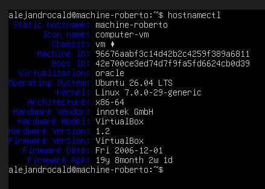
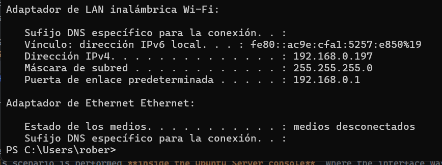
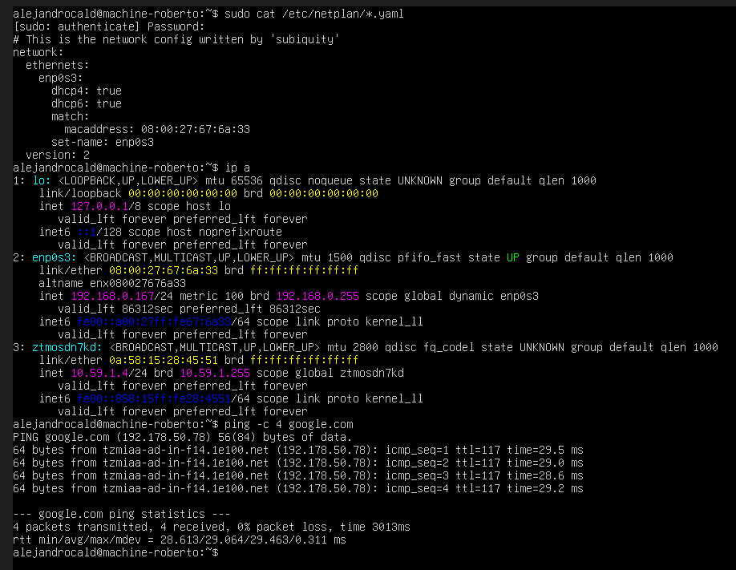
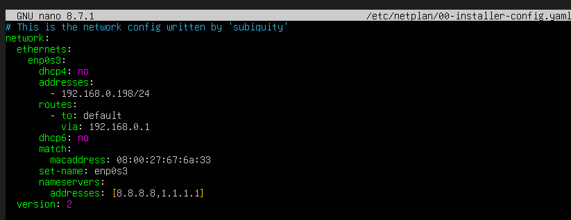
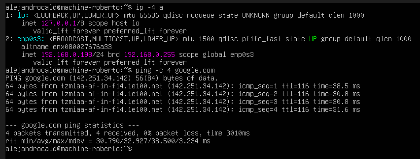
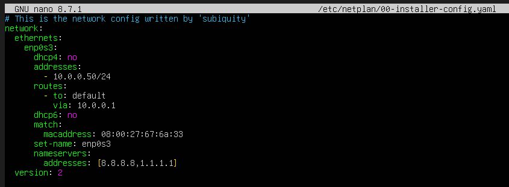
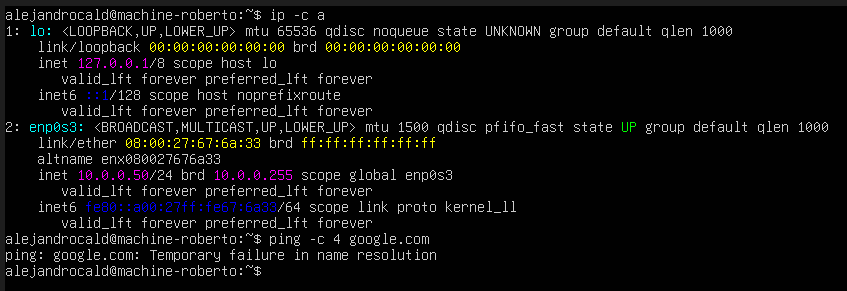

# HW-03 — Virtual Machine Network Modes (Bridge)

This assignment demonstrates three network configuration scenarios on a Ubuntu Server virtual machine, all running in **Bridge** mode:

1. IP obtained via **DHCP**
2. IP assigned **manually**, within the hypervisor's subnet
3. IP assigned **manually**, outside the hypervisor's subnet

The VM hostname is set to my name, and each scenario is verified with a `ping google.com` (4 executions).

**Note on where each step is performed:**
- Switching the network adapter to **Bridged Adapter** mode, and checking the hypervisor's own subnet, is done in the **hypervisor's GUI** (VirtualBox).
- All other commands (`hostnamectl`, `netplan`, `ip a`, `ping`, etc.) are run **inside the Ubuntu Server VM console**, not on the host machine.

---

## 0. Hostname Configuration

The hostname of the VM was set with:

```bash
sudo hostnamectl set-hostname machine-roberto
```

Verify with:

```bash
hostnamectl
```

**Screenshot placeholder:** `hostnamectl` output showing the configured hostname



---

## 1. Hypervisor Subnet Check
 
*(Performed in the hypervisor GUI, not inside the VM.)*
 
Before configuring the VM, the hypervisor's network adapter subnet was identified (this confirms whether an IP assignment falls inside or outside that subnet).
 
- Subnet: `192.168.0.0/24`
**Screenshot placeholder:** Hypervisor network settings


 
---

## 2. Scenario 1 — Bridge Mode with DHCP-assigned IP

The VM's network adapter was set to **Bridged Adapter** mode in the hypervisor settings (host-side step). The rest of this scenario is performed **inside the Ubuntu Server console**, where the interface was left to obtain its IP automatically via DHCP.

Check the interface configuration file (Netplan):

```bash
cat /etc/netplan/*.yaml
```

Example (DHCP):

```yaml
network:
  version: 2
  ethernets:
    enp0s3:
      dhcp4: true
```

Apply and check the assigned IP:

```bash
sudo netplan apply
ip a
```

Test connectivity:

```bash
ping -c 4 google.com
```

**Screenshot placeholder:** `ip a` showing the DHCP-assigned IP and `ping -c 4 google.com` result


---

## 3. Scenario 2 — Bridge Mode with Manual IP (inside the hypervisor's subnet)

The adapter remains in **Bridged Adapter** mode. From the **Ubuntu Server console**, a static IP was manually assigned, **inside** the same subnet identified in section 1 (but outside the DHCP range to avoid conflicts).

Edit the Netplan config:

```bash
sudo nano /etc/netplan/*.yaml
```

Example:

```yaml
network:
  ethernets:
    enp0s3:
      dhcp4: no
      addresses:
        - 192.168.0.198/24
      routes:
        - to: default
          via: 192.168.0.1
      dhcp6: no
      match:
        macaddress: 08:00:27:67:6a:33
      set-name: enp0s3
      nameservers:
        addresses: [8.8.8.8, 1.1.1.1]
  version: 2
```

Apply and verify:

```bash
sudo netplan apply
ip a
```

Test connectivity:

```bash
ping -c 4 google.com
```

**Screenshot placeholder:** `ip a` showing the manually assigned IP (inside subnet)


**Screenshot placeholder:** `ping -c 4 google.com` result


---

## 4. Scenario 3 — Bridge Mode with Manual IP (outside the hypervisor's subnet)

The adapter remains in **Bridged Adapter** mode. From the **Ubuntu Server console**, a static IP was manually assigned **outside** the hypervisor's subnet, using the gateway/router's actual LAN subnet instead (since the physical network — not the hypervisor's virtual switch — is what needs to route the traffic in bridge mode).

Example (replace with the values that match your real LAN, different from the hypervisor's virtual subnet):

```yaml
network:
  ethernets:
    enp0s3:
      dhcp4: no
      addresses:
        - 10.0.0.50/24
      routes:
        - to: default
          via: 10.0.0.1
      dhcp6: no
      match:
        macaddress: 08:00:27:67:6a:33
      set-name: enp0s3
      nameservers:
        addresses: [8.8.8.8, 1.1.1.1]
  version: 2
```

Apply and verify:

```bash
sudo netplan apply
ip a
```

Test connectivity:

```bash
ping -c 4 google.com
```

**Screenshot placeholder:** `ip a` showing the manually assigned IP (outside subnet)


**Screenshot placeholder:** `ping -c 4 google.com` result


---

## Repository
- **GitHub Repository:** *https://github.com/alejandrocald13/virtualizacion-26*
- **Branch:** `hw-03`